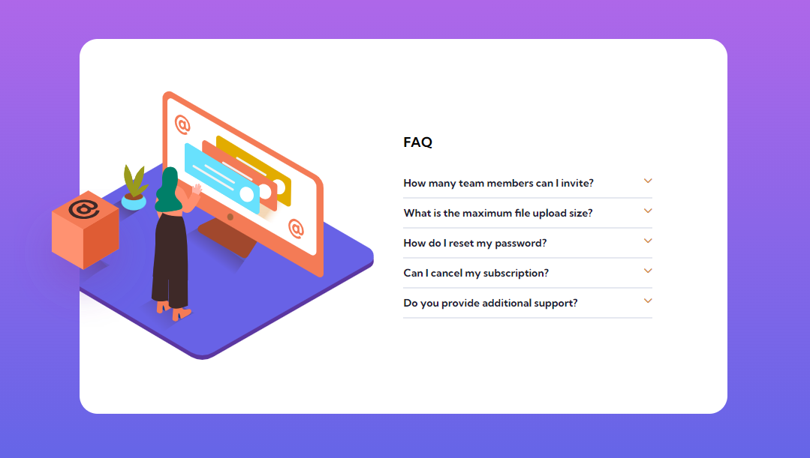

# Frontend Mentor - FAQ accordion card solution

This is a solution to the [FAQ accordion card challenge on Frontend Mentor](https://www.frontendmentor.io/challenges/faq-accordion-card-XlyjD0Oam). Frontend Mentor challenges help you improve your coding skills by building realistic projects. 

## Table of contents

- [Overview](#overview)
  - [The challenge](#the-challenge)
  - [Screenshot](#screenshot)
  - [Links](#links)
- [My process](#my-process)
  - [Built with](#built-with)
  - [What I learned](#what-i-learned)
  - [Useful resources](#useful-resources)
- [Author](#author)
 

## Overview

### The challenge

Users should be able to:

- View the optimal layout for the component depending on their device's screen size
- See hover states for all interactive elements on the page
- Hide/Show the answer to a question when the question is clicked

### Screenshot




### Links
- Live Site URL: [Live site](https://6487ac75d791b62f1f784257--fascinating-figolla-aa29cb.netlify.app/)

## My process

### Built with

- Semantic HTML5 markup
- CSS custom properties
- Flexbox
- Desktop-first workflow
- Javascript


### What I learned
My major learning is the hide and show functionality.
```javascript
header.forEach((headers, i) => {
    headers.addEventListener('click', () =>{
        headers.nextElementSibling.classList.toggle('active');
        const close = headers.querySelector('.open')
        const open = headers.querySelector('.close')

        if (headers.nextElementSibling.classList.contains('active')){
            close.classList.add('active')
            open.classList.remove('active')
        }else{
            close.classList.remove('active');
            open.classList.add('active')
        }
    })
})
```


### Useful resources
- [geeksforgeeks article](https://www.geeksforgeeks.org/how-to-create-a-faq-page-using-javascript/)
This article helped me to understand the toogle concept.  I'd recommend it to anyone still learning this concept.


## Author
- Frontend Mentor - [@chykB](https://www.frontendmentor.io/profile/chykB)
- Twitter - [@ChykB_](https://twitter.com/ChykB_?t=uvQ-FJKVC89P0w_65PAl4A&s=09)


